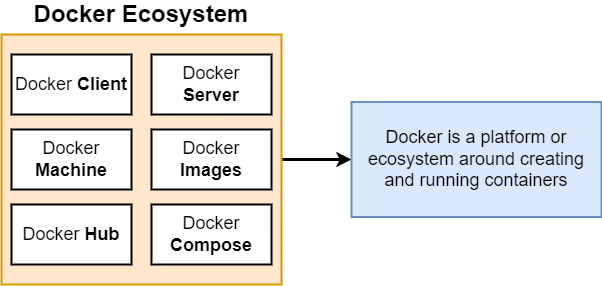
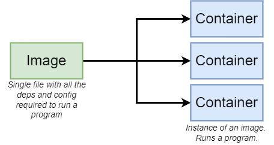
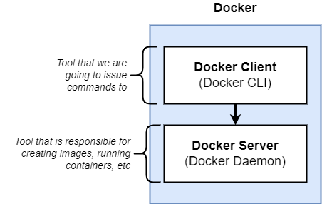
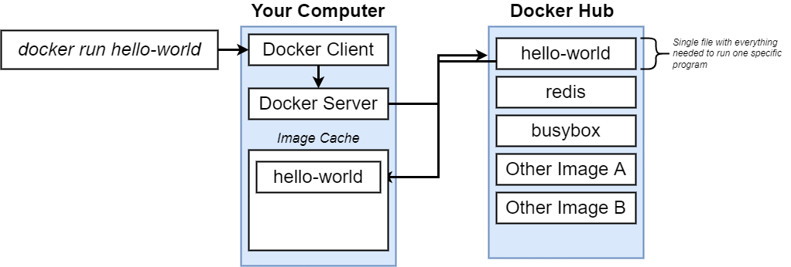
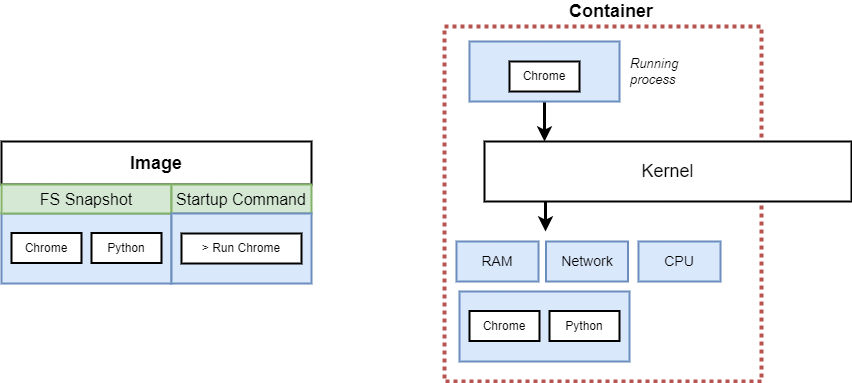

# Docker

## **Why Docker**
Docker makes it really easy to install and run software without worrying about setup or dependencies.

### *Without docker*

### *Docker ecosystem*

### *Docker image and container*

### *Docker components*

### *Running Image structure*

### *Container Deep*

