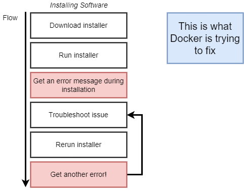

# Docker

## **Why Docker**
Docker makes it really easy to install and run software without worrying about setup or dependencies.

### *Without docker*

### *Docker ecosystem*

### *Docker image and container*

### *Docker components*

### *Running Image structure*

### *Container Deep*

## Creating custom docker image

### **Steps**

1. create a Dockerfile
2. specify base image
3. run commands to install additional components/ softwares
4. specify command to run the container

### **Analogus example**

writing Dockerfile = given a computer with no OS and being told to run chrome

Steps:  
1. install OS
2. start default browser
3. navigate to chrome.google.com
4. download installer
5. open file/folder
6. execute chrome_installer.exe
7. execute chrome.exe

*Analogus*:  
| steps | Dockerfile operations |
|-|-|
| step 1 | specify base image |  
| steps 2-6 | install components, plugins and softwares |  
| step 7 | command to run on startup |  

## Note

- Changing order of operations in Dockerfile can significantly change the time required to build the image.

- if an arbitary segment (long enough to identify uniquely) of sha256 ID (from start of sha256) is enough for docker to recognise image/ container, it will be referenced correctly.

